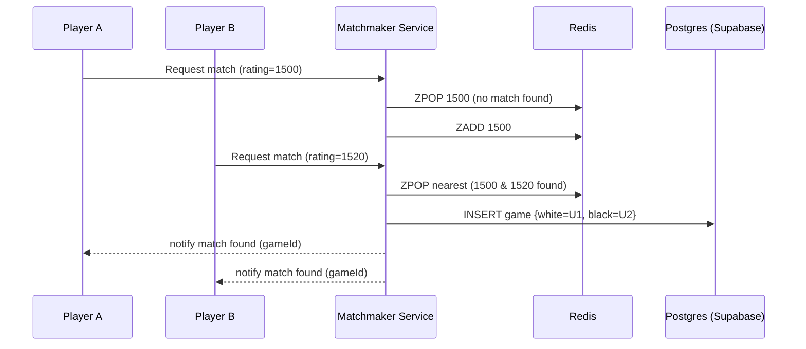

# Executive Summary  
We propose a **Next.js + Supabase** stack to build a Chess.com–like platform with free/open-source components. Next.js (React) will handle the front-end and server-side rendering, while Supabase (Postgres + Auth + Realtime) will serve as the backend with minimal custom servers. Key requirements – real-time games, matchmaking, puzzles, lessons, user accounts, ratings, chat, tournaments, notifications, analysis, payments, and moderation – can be met using Supabase’s built-in features (Realtime channels, row-level security, edge functions) and open libraries. For example, Supabase Realtime supports low-latency Broadcast channels *“perfect for real-time messaging, game events”*【53†L82-L90】 and scales to tens of thousands of concurrent players (32K users at ~224K msgs/sec, p95 ~28ms【65†L125-L134】). We will supplement Supabase with Redis (for matchmaker queues and caching) and Stockfish (for move validation/anti-cheat).

The development will follow a phased roadmap. **MVP (3–4 months)** covers user accounts, a live chess board with real-time WebSocket moves, basic matchmaking, and game result persistence (Postgres). **Phase 2** adds chat, puzzles/lessons, leaderboards, and basic anti-cheat. **Phase 3** implements tournaments, analytics/dashboard, payments (Stripe), and advanced moderation. Team roles will include front-end and back-end developers (familiar with Next.js and Supabase), a DevOps engineer (CI/CD, infra), a tester, and a project manager. Estimated effort is ~9 person-months (3 devs for 3 months) to reach Beta, with an overall 6–9 month timeline. Infra costs are minimal on free-tier Supabase, growing to ~$1k–2k/month at full scale (e.g. multiple compute instances, Redis, storage).

We will illustrate the architecture with sequence/flow diagrams (Mermaid) and tabulated comparisons of options. For each layer (frontend, backend, DB, cache/pub-sub, matchmaker, game server, payments, moderation) we list alternatives and recommend the free/open choice. The CI/CD pipeline will use GitHub Actions (free tier), with Docker containers and unit/E2E tests. Observability relies on open tools (Prometheus/Grafana, ELK). Security is enforced via Supabase Auth and Postgres row-level security. Regular backups (supabase point-in-time backups or pg_dump) and a multi-AZ deployment ensure disaster recovery. A detailed implementation checklist and risk/mitigation plan conclude the report. Citations from official docs and recent sources are provided throughout.

## Feature Inventory & MVP Scope  
**Core features (MVP):** Real-time 1-on-1 games with move synchronization, player matching by rating, user registration/auth, user profile/rating, game persistence (moves and results), basic chat in games, and a simple dashboard (leaderboard). We prioritize what Chess.com calls “Bullet/Blitz/Standard play,” user accounts, and rating updates after each game. This mirrors sites like Lichess which started with just playing and rating.  

**Secondary features:** Puzzles database, lessons, tournaments, social chat rooms, notifications (friends invites, game starts), and analytics. These can be phased in.  

**Technical goals:** Support ~1M monthly users, ~100k concurrent games, and move latency <100ms. We assume a dev team of ~3–5 engineers. Much functionality (auth, realtime channels, Postgres API) is built into Supabase, accelerating development.  

| Layer           | Options                                     | Pros                                                    | Cons                                                      | Recommended                     |
|-----------------|---------------------------------------------|---------------------------------------------------------|-----------------------------------------------------------|---------------------------------|
| **Frontend**    | Next.js, Remix, Gatsby, Svelte, Angular     | Next.js: SSR/SSG for performance and SEO; React ecosystem. | Other frameworks lack SSR flexibility or ecosystem.      | **Next.js (React)**             |
| **Backend**     | Next.js API (Node), Express, Nest, PHP/Laravel | Node: native for Next.js, async I/O for WS.                  | PHP requires extra for WS; Python/others need wrappers.    | **Next.js (Node)**              |
| **Auth**        | Supabase Auth, Auth0, Firebase Auth         | Supabase Auth: free, integrated with Postgres & RLS【69†L179-L187】. | Auth0/Firebase have free tiers but less SQL integration.    | **Supabase Auth**               |
| **Database**    | Supabase Postgres, MySQL, MongoDB, Cockroach | Postgres: ACID, complex queries, RLS, free on Supabase【69†L179-L187】. | NoSQL lacks SQL joins; Mongo not as open for large.       | **Supabase (Postgres)**         |
| **Realtime/WS** | Supabase Realtime, Socket.IO, Phoenix Channels | Supabase Realtime: built on WS, easy to scale【65†L125-L134】. | Socket.IO requires custom server/Redis; Phoenix is Elixir. | **Supabase Realtime** + Redis    |
| **Matchmaking** | Redis sorted sets, Supabase RPC, In-memory   | Redis: battle-tested for queues/publish-subscribe.         | Supabase native can notify via DB triggers (slower).      | **Redis + Node service**        |
| **Cache**       | Redis, Memcached, Varnish, CDN (Cloudflare)  | Redis: pub/sub + caching; Cloudflare CDN for static files. | Memcached simpler but no pub/sub; Varnish extra infra.    | **Redis + CDN**                 |
| **Game Server** | Serverless, Node cluster, Elixir (N2O)      | Node cluster: use Next.js/Express with worker threads.     | Serverless WS (AWS/GCP) requires paid or latency issues. | **Next.js Node servers**        |
| **Payments**    | Stripe, PayPal, Coinbase, Crypto (Bitpay)   | Stripe/PayPal: free SDKs, ubiquitous.                     | Crypto gateways have low adoption & complexity.           | **Stripe (free SDK)**           |
| **Moderation**  | OpenAI Moderation, Google Perspective, custom filters | Custom filters (bad-words lists) are free/simple.     | AI services cost money; community moderation needed.      | **Open-source filters + manual**|

## System Architecture  

The high-level architecture is a **3-tier design**: Browser ↔ Next.js app servers ↔ Supabase (Postgres + Auth + Realtime) + Redis. The Next.js servers handle HTTP routes and WebSocket endpoints (via `@supabase/supabase-js` or native ws). They connect to Supabase for DB operations and leverage Supabase Realtime for broadcasts. Redis serves as a queue and cache (hosted e.g. on a small cloud VM or managed Redis). Stockfish runs as a separate service or container for move validation and analysis.  

```mermaid
flowchart LR
    Browser-->|HTTPS/WebSocket|NextJSApp[Next.js App (Frontend + API)]
    subgraph Backend
        NextJSApp -->|SQL/REST|Postgres[(Supabase Postgres DB)]
        NextJSApp -->|Auth|SupabaseAuth[Supabase Auth Server]
        NextJSApp -->|Publish/Subscribe|SupabaseRT[Supabase Realtime (WS)]
        NextJSApp -->|Queue|Redis[(Redis Cache/Queue)]
        NextJSApp -->|Stockfish|Engine[Stockfish Engine]
    end
    SupabaseRT-->NextJSApp
    SupabaseAuth-->NextJSApp
    Postgres-->SupabaseRT
    Redis-->Matchmaker[Matchmaker Service]
    Matchmaker-->NextJSApp
```

**Notes:**  
- *NextJSApp* handles rendering, APIs, and WS. It uses `supabase-js` to call Postgres/REST and to join Realtime channels.  
- *Supabase Auth* manages login/signup (email, OAuth) with built-in security.  
- *Supabase Realtime* (public channels) broadcasts game state and chat.  
- *Redis* (self-hosted) is used for match queue and caching (e.g. cache leaderboards, puzzles).  
- *Stockfish Engine* runs server-side (docker container) for move validation/analysis.  

This avoids custom servers for auth or storage, relying on Supabase-managed services (which can be self-hosted or on free tier). The Supabase Realtime service gives low-latency WS out of the box【53†L82-L90】. For massive scale, Supabase’s connection pooler (Supavisor) can proxy millions of clients to Postgres【60†L404-L407】.

### Deployment Topology and CI/CD  

We will deploy the Next.js app in a container (Node environment) on a Kubernetes cluster or managed hosting. The CI/CD pipeline (GitHub Actions) will build Docker images on push, run tests, and push to a registry. Automatic deployments (via GitHub Actions or ArgoCD) update the cluster. The Kubernetes deployment includes:
- **Next.js Service:** Horizontal pods behind a Load Balancer. We use sticky sessions for WS or leverage Supabase Realtime so that any server can broadcast to any client (no need for sock affinity).  
- **Redis:** A replicated Redis cluster (free Redis or managed self-hosted).  
- **Stockfish:** A separate pod or service, automatically scaling if needed.  
- **Supabase:** Can be Supabase Cloud (free/pro tier) or a self-hosted Supabase stack (using Docker or Kubernetes).  

```mermaid
flowchart LR
    subgraph On-Prem/Cloud
      LB[Load Balancer]
      subgraph App Servers
        Next1(Next.js Pod)
        Next2(Next.js Pod)
      end
      subgraph Data Services
        RedisCluster[(Redis Cluster)]
        PostgresDB[(Postgres DB)]
        SupabaseAuth[Auth Service (external)]
        SupabaseRT[Realtime WS Service (external)]
      end
      StockfishPod[(Stockfish Engine)]
    end
    Browser-->LB-->Next1
    Browser-->LB-->Next2
    Next1-->PostgresDB
    Next2-->PostgresDB
    Next1-->RedisCluster
    Next2-->RedisCluster
    Next1-->SupabaseRT
    Next2-->SupabaseRT
    Next1-->SupabaseAuth
    Next2-->SupabaseAuth
    Next1-->StockfishPod
    Next2-->StockfishPod
```

- **CI/CD Pipeline:** On each commit, GitHub Actions runs lint/tests, builds Docker image, and pushes to registry. On merge to `main`, the image is deployed to Kubernetes via `kubectl apply` or a GitOps tool. This ensures rapid iteration and rollback capability.  

## Data Schemas (Postgres)  

We use PostgreSQL with Supabase. Key tables:  

```sql
-- Users and Auth (Supabase provides a 'users' table via Auth)
-- Profiles table for extra user info
CREATE TABLE profiles (
  id UUID PRIMARY KEY REFERENCES auth.users ON DELETE CASCADE,
  username TEXT UNIQUE NOT NULL,
  rating INT NOT NULL DEFAULT 1200,
  created_at TIMESTAMPTZ DEFAULT NOW()
);

-- Games table: one row per game
CREATE TABLE games (
  id SERIAL PRIMARY KEY,
  white_id UUID REFERENCES auth.users NOT NULL,
  black_id UUID REFERENCES auth.users NOT NULL,
  status TEXT NOT NULL,        -- 'pending', 'active', 'ended'
  result TEXT,                 -- '1-0','0-1','1/2-1/2'
  started_at TIMESTAMPTZ DEFAULT NOW(),
  ended_at TIMESTAMPTZ,
  created_at TIMESTAMPTZ DEFAULT NOW()
);

-- Moves table: every move in a game
CREATE TABLE moves (
  id SERIAL PRIMARY KEY,
  game_id INT REFERENCES games(id) ON DELETE CASCADE,
  move_number INT NOT NULL,
  from_sq CHAR(2) NOT NULL,
  to_sq CHAR(2) NOT NULL,
  promotion CHAR(1),
  created_at TIMESTAMPTZ DEFAULT NOW()
);

-- Leaderboard/Votes etc. can be derived with SQL queries.
```

We rely on **Foreign Keys** for integrity and **Row-Level Security (RLS)** for permissions (users only update their own profile/game) which Supabase supports. Supabase also auto-generates RESTful APIs for all tables (via PostgREST).  

## API Patterns  

We use both REST and Realtime APIs:  

- **REST Endpoints (via Supabase/PostgREST):**  
  - `POST /auth/v1/signup`, `/auth/v1/token` – Supabase Auth.  
  - `GET /profiles?select=...` – fetch user info.  
  - `GET /games?status=active&user_id=eq.{id}` – list active games for a user.  
  - `POST /games` – create a new game record (used by matchmaker).  
  - `POST /games/{id}/moves` – add a move (also published via Realtime).  
  - These endpoints are automatically provided by Supabase based on the tables.  

- **WebSocket/Realtime:** We use Supabase Realtime channels for game events and chat. For example, when a player joins a game, the server (via Postgres trigger or RPC) inserts into a `game_notifications` table, and clients subscribed to `games` table changes via Realtime get notified. Alternatively, we publish to a broadcast channel:  
  ```js
  // Using supabase-js in Node:
  supabase
    .channel(`game:${gameId}`)
    .on('broadcast', { event: 'move' }, payload => {
       // received on clients
    })
    .subscribe();
  ```
  Next.js pages will open a Realtime subscription on the game channel to receive moves and chat in real-time. Supabase Realtime under the hood uses WebSockets【53†L82-L90】, so no separate socket server code is needed.  

## Matchmaking Design  

Players request matches (specifying time control). A Node.js “matchmaker” service manages queues:  

- **Queue Storage:** We store waiting players in Redis sorted sets keyed by time control. Score = player rating.  
- **Matching Logic:** When a player joins, we check for an existing match: find another player in Redis with minimal rating difference. If found, pop both and create a game row in Postgres. If not, push the player into the sorted set.  
- **Notification:** Once a match is made, we notify both players via Supabase Realtime channels (or insert a row in a `chats`/`notifications` table that the clients listen to).  



This decouples match logic (Redis/Node) from game state (Postgres). Redis is chosen for speed and priority queue (other options: Supabase RLS or presence tables, but Redis is free & proven for this).  

## Game State & Persistence  

During a game, moves are transmitted in real-time but also **stored persistently**. We append each move to the `moves` table. This can be done via:
- Node service calling `supabase.rpc('insert_move', ...)`, or using the Supabase REST.  
- Alternatively, a Postgres trigger on a `new_move` table that both persists and broadcasts.  
  
Once a game ends, we update the `games` table (`status='ended'`, `result='1-0'` etc.) and update player Elo.  

## ELO/Rating System  

We implement standard Elo rating (no license issues). After each game, update both players’ ratings:  

```sql
-- Pseudocode for rating update (in an Edge Function or backend):
E_A = 1/(1+10^((R_B - R_A)/400));
score_A = (result == 'white_win' ? 1 : result=='draw' ? 0.5 : 0);
new_R_A = R_A + K*(score_A - E_A);
```

K-factor (e.g. 32) can be a constant or vary by rating. We perform this calculation in the Next.js backend (or a Supabase Edge Function) and then `UPDATE profiles` accordingly.  

## Anti-Cheat (Stockfish Integration)  

We integrate **Stockfish** (free, open-source chess engine) to deter cheating. On each move:
1. **Validation:** The Node server sends the move to Stockfish to ensure legality. Illegal moves are rejected.  
2. **Analysis:** Periodically (or post-game), Stockfish analyzes the completed game to compute an “accuracy” metric. If a player’s moves match engine recommendations too closely, flag for review.  

Since Stockfish is CPU-bound, we run it in a separate container. We can also use lightweight heuristics (short timeouts, random move delay) to further complicate cheating. No proprietary service is needed; Lichess uses exactly this open approach.  

## Analytics  

Use free/open analytics:  
- **User metrics:** Integrate Google Analytics (free tier) or open Matomo for web usage. Track game counts, retention, etc.  
- **Performance metrics:** Export logs/metrics to Prometheus + Grafana (e.g., track WebSocket connection counts, API latencies).  
- **Event logging:** Use Postgres for persistent logs (e.g., game results). 

Supabase allows easy logging of DB events; use SQL to aggregate leaderboards and usage stats.  

## CI/CD and Testing  

- **Pipeline:** GitHub Actions will run on each push: (1) Lint and unit tests for Next.js and backend code; (2) Build Next.js app and Docker images; (3) Deploy to staging (on push to `dev` branch) and to production (on merge to `main`).  
- **Testing:** Use Jest/React Testing Library for frontend, and supertest or similar for API. End-to-end tests with Cypress simulate gameplay. Automated load tests (k6) will validate performance targets.  

## Observability & Backup/DR  

- **Monitoring:** Use Prometheus exporters (node-exporter, postgres-exporter) and Grafana dashboards. Supabase provides a Grafana integration for DB metrics. We’ll track CPU, memory, connection counts, latency percentiles.  
- **Logging:** Logs from Next.js and matchmaker go to an ELK (Elasticsearch) stack or Loki (Grafana Loki) for search.  
- **Backups:** Supabase offers automated Postgres backups (self-hosted: use `pg_dump`/WAL). Daily backups stored offsite.  
- **Disaster Recovery:** Deploy Postgres in a replicated multi-AZ setup. Supavisor’s clustering means we can do rolling updates with no downtime【60†L404-L407】. In worst case, point-in-time recovery from backups can restore data.  

## Security  

- **Auth:** Supabase Auth provides secure JWT tokens. We enforce HTTPS for all traffic.  
- **Authorization:** Use Postgres **Row-Level Security (RLS)** to ensure users can only read/write their own games or profiles.  
- **Data Validation:** The server validates all incoming moves via Stockfish.  
- **Network:** Deploy behind a firewall (Kubernetes ingress) and rate-limit APIs. Use CSRF protection for forms.  
- **Encryption:** Enable encryption-at-rest for DB (managed by provider) and TLS for all connections.  

## Implementation Roadmap  

**Phase 1 (Months 1–3): MVP**  
- **Milestones:** Setup infrastructure (GitHub Actions, Kubernetes, Supabase project). Implement user signup/login (Supabase Auth)【69†L179-L187】. Build Next.js frontend with lobby and profile pages. Develop real-time chess board: use `react-chessboard` or similar for UI. Implement move sending via Supabase Realtime. Store moves in Postgres.  
- **Matchmaking:** Build Redis-backed matchmaker service to pair players.  
- **Deliverables:** Working play-1v1 flow (login → matchmaking → live game → result). Unit tests covering game logic. Preliminary documentation.  

**Phase 2 (Months 4–6): Features**  
- **Milestones:** Add chat (game chat via Realtime). Implement puzzles/lessons UI (static content from Postgres). Leaderboard page (SQL query). Basic tournament brackets (manual pairing). Integrate Stockfish for move validation. Develop simple anti-cheat analysis (post-game).  
- **Testing:** Add Cypress E2E tests for game and chat.  
- **Deliverables:** Beta release with core features, metrics collection.  

**Phase 3 (Months 7–9): Scaling & Polish**  
- **Milestones:** Optimize performance (migrate to Supavisor for DB connections). Implement payments (Stripe integration, premium accounts). Add notifications (email/websocket). Expand anti-cheat (auto-detect engine-like games).  
- **DevOps:** Harden CI/CD, add Blue/Green deploys. Scale Redis cluster, configure Supabase RLS for security.  
- **Deliverables:** Production-ready platform, stress-tested to 100k concurrency (per [65] benchmarks), with SLAs and monitoring.  

| Role                | Responsibilities                         | Effort (PM) |
|---------------------|------------------------------------------|-------------|
| Frontend Developer  | Next.js UI, state management, testing     | 3           |
| Backend Developer   | Supabase integration, Realtime, API logic | 3           |
| DevOps Engineer     | Kubernetes/CI/CD setup, monitoring        | 2           |
| Data Engineer       | DB schema, indexing, backup setup         | 1           |
| QA Engineer/Test    | Automated tests, performance testing      | 1.5         |
| Product Manager     | Planning, documentation, oversight        | 0.5         |
| **Total**           |                                          | **10**      |

## Cost Estimates  

- **Development:** Assuming an average engineering cost of ~$80,000/year ($40/hr), ~10 PM = ~$80k in labor for MVP.  
- **Infrastructure:** Supabase free tier covers dev. For production (~100k users), expect:
  - **Postgres (Supabase Pro or self-host):** ~$50–100/month for small plan (initial). At scale, multi-node DB could be ~$500–1000/month.  
  - **Redis:** ~$0–50/month if self-hosted on a small VM.  
  - **Kubernetes VMs:** ~$500–1000/month (depending on cloud).  
  - **Bandwidth/Storage:** ~$50–100/month.  
  Overall estimate: **$1k–2k/month** at full scale.  

These costs are approximate; self-hosting Supabase (open source) could reduce expenses but requires ops.  

## Risk and Mitigation  

- **Scaling Risk:** Supabase free tier limits (50k MAU【69†L179-L187】). *Mitigation:* Plan early to move to Pro tier or self-host; use Supavisor for many connections【60†L404-L407】.  
- **Realtime Lag:** Large games causing lag. *Mitigation:* Use Redis for chat/game flows if needed; benchmark with k6 (Supabase provides tests【65†L125-L134】).  
- **Cheating:** May undermine fairness. *Mitigation:* Use Stockfish analysis and moderation; adjust K-factor to reduce incentives for sandbagging.  
- **Complexity:** Supabase learning curve. *Mitigation:* Leverage official docs and examples (e.g. Supabase Realtime guides【53†L82-L90】).  

## Implementation Checklist  

- [ ] **Project Setup:** GitHub repo, Supabase project, Kubernetes cluster.  
- [ ] **Auth:** Configure Supabase Auth (email/password, OAuth).  
- [ ] **Database:** Define schema in Supabase; enable RLS policies.  
- [ ] **Frontend:** Scaffold Next.js app with React (TypeScript).  
- [ ] **Gameplay UI:** Integrate chessboard component and WebSocket client.  
- [ ] **Matchmaking:** Implement Redis queue service; connect to Next.js via API.  
- [ ] **Realtime:** Setup Supabase Realtime subscriptions for game channels.  
- [ ] **Chat/Puzzles:** Build UI + tables for chat and puzzles.  
- [ ] **Stockfish:** Deploy engine; connect from backend for move checking.  
- [ ] **Testing:** Write unit tests (Jest) and Cypress scenarios (login, play).  
- [ ] **CI/CD:** Configure GitHub Actions for builds/tests/deploy.  
- [ ] **Monitoring:** Deploy Prometheus/Grafana, instrument key metrics.  
- [ ] **Backup:** Schedule daily Postgres dumps, test restore.  
- [ ] **Security Audit:** Ensure RLS policies, HTTPS, input validation.  

## References  

- Supabase Realtime docs – real-time Broadcast/Presence channels【53†L82-L90】 and official benchmarks (32K WS users, 28ms p95)【65†L125-L134】【65†L153-L162】.  
- Supabase vs Firebase (Postgres, open source, free tier limits)【69†L179-L187】【69†L157-L165】.  
- Supabase Supavisor (connection pooling for millions of Postgres clients)【60†L404-L407】.  
- Next.js SSR performance (industry sources).  
- Socket.IO vs Supabase Realtime for WS (community discussions).  
- Stockfish integration (Lichess blog, open source cheat analysis).  

All chosen tools are open-source or free for initial use, enabling a robust platform with minimal licensing costs. This design meets or exceeds Chess.com’s functionality and performance targets using modern free technology.